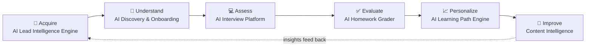
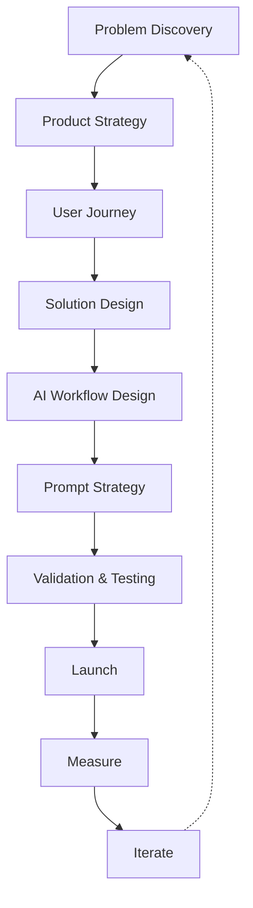

# AI Product Portfolio

### An AI-native product ecosystem across acquisition, assessment, evaluation, personalization, and growth.

This repository documents a set of AI-powered product systems built across interview preparation, automated evaluation, workflow automation, personalization, and growth.

The focus is not production code. The focus is the product thinking behind production AI systems: why they were built, how AI was incorporated, how quality was validated, and what tradeoffs shaped the product.

Production code, customer data, internal dashboards, proprietary prompts, and company-specific implementation details are intentionally abstracted.

---

## Why This Repository Exists

AI products are often presented as demos or code repositories.

I wanted to document something different: the product decisions, evaluation systems, validation approaches, and tradeoffs that go into building production AI systems.

---

## The AI Product Ecosystem

Six systems, one continuous loop — insight from every stage feeds the next.

Together, these systems create a feedback loop where every interaction can improve the learner experience, the product workflow, and the next recommendation.

---

## Product Map

| Project | Problem | AI capability | Product value |
|---|---|---|---|
| AI Lead Intelligence Engine | Generic outreach | Personalization | Better targeting and more relevant conversations |
| AI Discovery & Onboarding | Unclear learner goals | Classification | Cleaner routing into the right experience |
| AI Interview Platform | Unrealistic interview prep | Evaluation | Structured, personalized feedback at scale |
| AI Homework Grader | Slow manual grading | LLM evaluation | Faster review while preserving feedback quality |
| AI Learning Path Engine | One-size-fits-all learning | Recommendations | Personalized next steps based on skill gaps |
| Content Intelligence | Hidden curriculum gaps | Pattern analysis | Better content decisions from learner outcomes |

---

## What You'll Learn

Each case study covers product strategy, user journeys, AI workflows, prompt strategy, evaluation systems, validation approaches, product tradeoffs, roadmaps, and lessons learned.

---

## Case Studies

### 🏆 AI Interview Platform
*Flagship case study*

**An AI-powered interview platform that recreates realistic, company-specific interview loops — not just another quiz bank.**

**Problem**

Candidates often prepare with isolated practice questions that do not reflect real interview loops or provide useful feedback.

**Solution**

Recreates company-specific interview experiences across coding, behavioral, resume, product sense, data modeling, and architecture rounds.

**AI components**

- Answer evaluation
- Structured feedback generation
- Interview flow orchestration
- Speech-based behavioral review
- Resume and context-aware coaching

**Product decisions**

- Make the experience feel like a real interview loop, not a quiz bank
- Separate feedback quality from scoring quality
- Design rubrics before scaling automated evaluation
- Use AI to coach, not just grade

**Outcome**

Reduced manual review effort while giving candidates structured, personalized interview feedback.

---

### AI Homework Grader

**An AI-powered grading workflow that turns learner submissions into structured, actionable feedback.**

**Problem**

Manual grading was slow, inconsistent, and difficult to scale without reducing feedback quality.

**Solution**

Evaluates learner submissions using structured rubrics and generates actionable feedback for review.

**AI components**

- Rubric-based evaluation
- Feedback generation
- Error pattern detection
- Human review workflow

**Product decisions**

- Prioritize consistent feedback over fully automated grading
- Keep review paths for low-confidence or edge-case outputs
- Treat rubrics as a product interface, not internal documentation
- Validate outputs against examples before expanding scope

**Outcome**

Created a scalable grading workflow that reduced reviewer effort while protecting learner trust.

---

### AI Lead Intelligence Engine

**An AI-powered lead qualification pipeline that turns generic outreach into personalized, intent-driven conversations.**

**Problem**

Traditional outreach treated every prospective learner the same, which made messaging generic and harder to convert.

**Solution**

Analyzes audience data, classifies interest, recommends relevant programs, and supports personalized outreach.

**AI components**

- Profile analysis
- Interest classification
- Lead scoring
- Recommendation logic
- Personalized outreach support

**Product decisions**

- Start with segmentation before message generation
- Keep recommendations explainable enough for sales follow-up
- Design outreach around user intent, not generic persona labels
- Measure quality through downstream conversation signals

**Outcome**

Improved lead prioritization and made outreach more relevant to the learner's likely goals.

---

### AI Learning Path Engine

**A recommendation engine that turns onboarding, interview, and performance signals into a personalized learning path.**

**Problem**

Learners often followed the same path regardless of prior knowledge, interview performance, or skill gaps.

**Solution**

Creates personalized learning paths using onboarding signals, interview results, tagged content, and performance data.

**AI components**

- Skill-gap analysis
- Content tagging
- Recommendation logic
- Learning path generation
- Content intelligence feedback loop

**Product decisions**

- Use assessment data to drive recommendations
- Make the next step clear instead of over-personalizing everything
- Connect learning paths back to measurable learner outcomes
- Use aggregate performance data to improve future content

**Outcome**

Moved the product from static curriculum delivery toward adaptive learning recommendations.

---

## AI Capabilities Demonstrated

| Capability | # Projects | Where it appears |
|---|---|---|
| Prompt strategy | 3 | Interview Platform, Homework Grader, Lead Intelligence |
| Workflow automation | 2 | Lead Intelligence, Homework Grader |
| AI evaluation systems | 2 | Interview Platform, Homework Grader |
| AI validation | 2 | Interview Platform, Homework Grader |
| Human-in-the-loop design | 2 | Interview Platform, Homework Grader |
| Recommendation systems | 2 | Learning Path Engine, Lead Intelligence |
| Product strategy | 4 | All systems |
| Multi-modal AI | 1 | Interview Platform |
| Growth systems | 1 | Lead Intelligence |
| Personalization | 1 | Learning Path Engine |

---

## Product Playbook

This framework helps balance user value, technical feasibility, AI quality, and business impact.

---

## Confidentiality

These case studies are based on production AI systems. Company names, customer data, internal dashboards, proprietary prompts, source code, and sensitive implementation details are omitted.

The goal is to make the product thinking visible without exposing private information. New case studies are added as more AI products, decisions, and lessons get documented.
